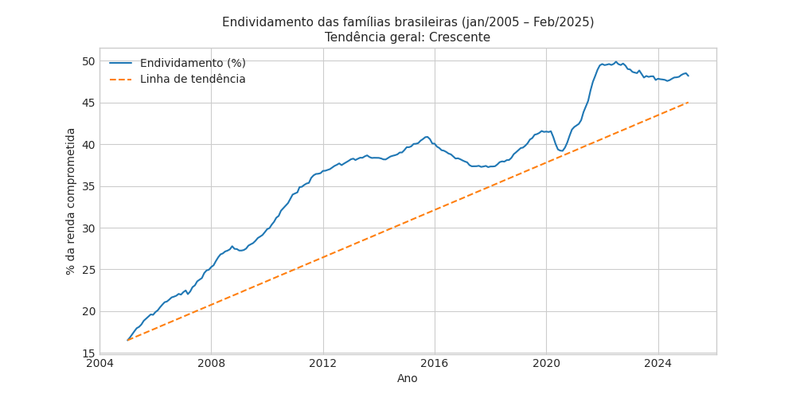
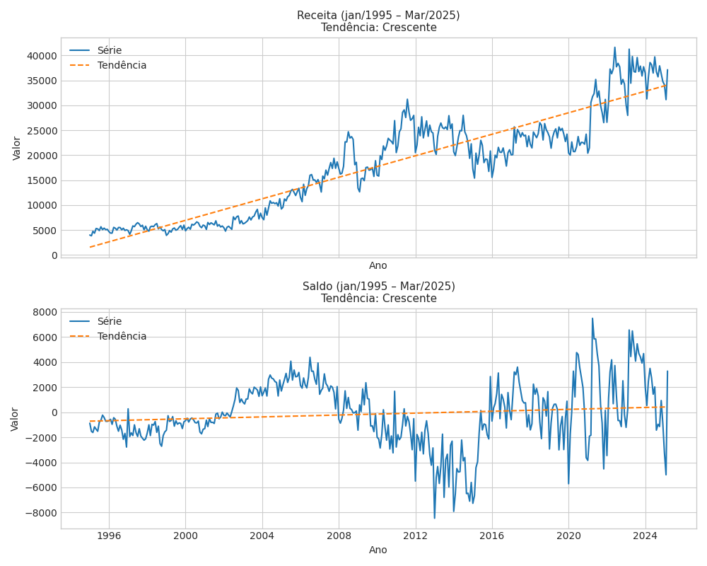
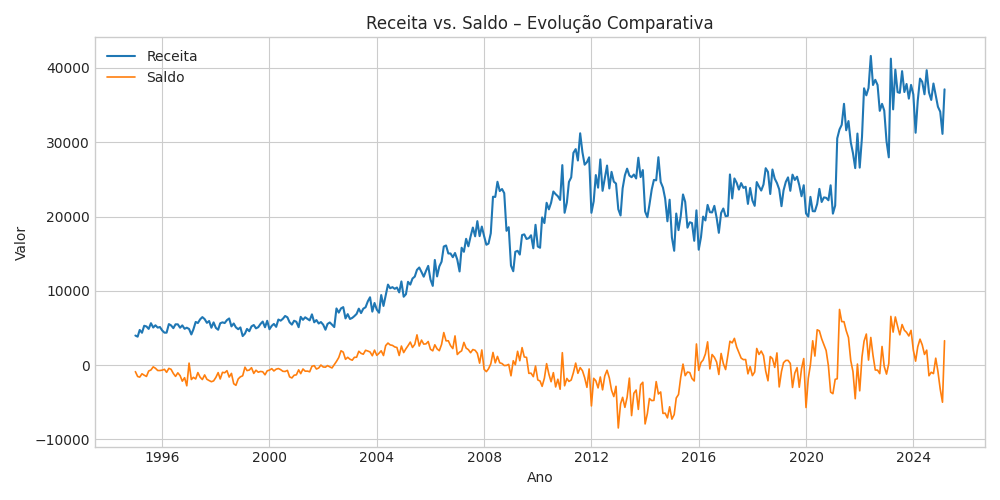

# Tendencia do Endividamento/comprometimento de renda das famílias brasileiras (Atividade 1):

 

- **Tendência geral (2005-2025):** Crescente  |  Inclinação ≈ 0.118 ponto percentual/mês

- **Tendência últimos 5 anos:**      Crescente  |  Inclinação ≈ 0.139 ponto percentual/mês

 

Com base no gráfico analisado é possivel notar que o comprometimento da renda das famílias brasileiras com dívidas segue uma tendência claramente crescente, isso se deve principálmente há alguns fatores:

**1. Expansão do crédito nos anos 2000 e 2010** – A popularização de consignado, cartão e financiamento imobiliário deu acesso fácil a dinheiro emprestado; a dívida subiu mais rápido que a renda.

**2. Inflação e perda de poder de compra** – Custos de alimentação, energia e moradia cresceram mais que salários; muitas famílias usaram crédito para fechar o mês, elevando o nível de endividamento.

**3. Juros elevados** – Taxas finais ao consumidor são muito altas; parcelas ficam caras, prolongam prazos e aumentam o porcentual da renda comprometida.

**4. Choques recentes (pandemia e pós-pandemia)** – Perda de emprego/receita em 2020-21 levou famílias a renegociar ou assumir novas dívidas; o alívio veio devagar, e o saldo devedor seguiu subindo.

# Atividade 2 (saldo e receita):

 

### Saldo X Receita

 

 

## Tendências Calculadas
**Receita:** Crescente  |  Inclinação = 89.83  |  R² = 0.86
**Saldo  :** Crescente  |  Inclinação = 3.14  |  R² = 0.02

A receita sobe porque os preços, a economia e a eficiência da cobrança aumentam; já o saldo oscila porque, cada vez que o governo ganha mais, ele também gasta mais (ou enfrenta despesas inesperadas), então o “dinheiro que sobra” não melhora na mesma velocidade.